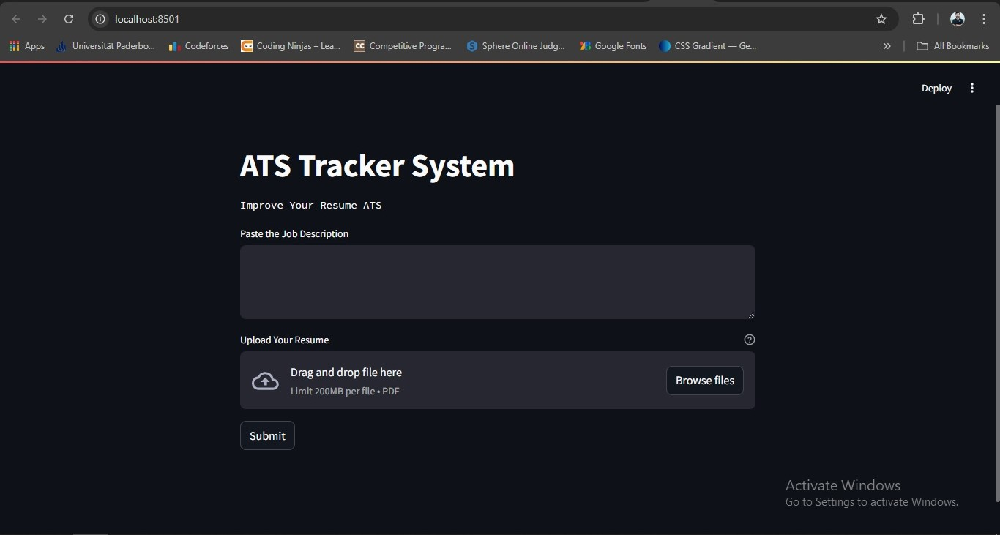

# ATS Tracker System



ATS Tracker System is a Streamlit application designed to help job seekers improve their resumes by analyzing them against job descriptions. It uses Google Generative AI to evaluate resumes and provides feedback on how well they match the job description, along with missing keywords and a profile summary.

## Features

- **Resume Evaluation:** Upload your resume in PDF format and receive a detailed evaluation based on the provided job description.
- **Job Description Matching:** Get a percentage match score indicating how well your resume aligns with the job description.
- **Keyword Analysis:** Identify missing keywords in your resume that are crucial for the job application.
- **Profile Summary:** Receive a summary of your profile to enhance your resume for specific job applications.

## Installation

To run this application locally, follow these steps:

1. **Clone the repository:**

    ```bash
    git clone https://github.com/yourusername/smart-ats.git
    cd smart-ats
    ```

2. **Create a virtual environment:**

    ```bash
    python -m venv venv
    ```

3. **Activate the virtual environment:**

    - On Windows:

        ```bash
        venv\Scripts\activate
        ```

    - On macOS and Linux:

        ```bash
        source venv/bin/activate
        ```

4. **Install the required dependencies:**

    ```bash
    pip install -r requirements.txt
    ```

5. **Set up environment variables:**

   Create a `.env` file in the project root directory and add your Google API key:

    ```plaintext
    GOOGLE_API_KEY=your_google_api_key
    ```

6. **Run the Streamlit app:**

    ```bash
    streamlit run app.py
    ```

## Usage

1. **Open the application:** After running the above command, a new tab in your default web browser should open automatically, pointing to `http://localhost:8501`.

2. **Paste the Job Description:** Copy and paste the job description in the provided text area on the page.

3. **Upload Your Resume:** Click on the "Upload Your Resume" button to select and upload your resume in PDF format.

4. **Submit:** Click the "Submit" button to process the resume against the job description.

5. **View Results:** The application will display a match percentage, missing keywords, and a profile summary to help you improve your resume.

## Dependencies

- [Streamlit](https://streamlit.io/)
- [Google Generative AI](https://cloud.google.com/ai-generative-ai)
- [PyPDF2](https://pypi.org/project/PyPDF2/)
- [python-dotenv](https://pypi.org/project/python-dotenv/)


## Contributing

Contributions are welcome! Please feel free to submit a Pull Request or open an issue for any bug fixes or new features.

## Acknowledgments

- This project uses the [Google Generative AI](https://cloud.google.com/ai-generative-ai) API to generate content.
- Special thanks to the open-source community for their contributions to the libraries used in this project.
